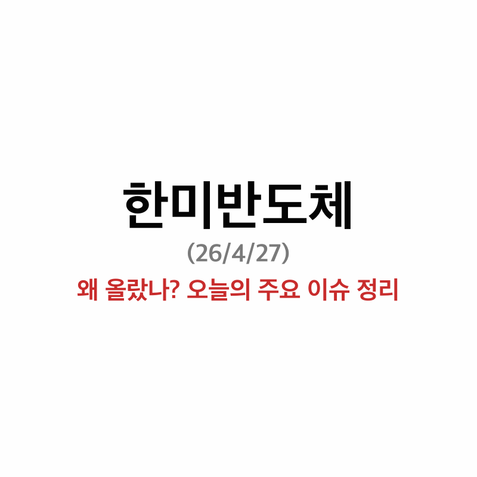

# 한미반도체 오늘 26% 폭등, VI 발동 — 무슨 일이 있었나

오늘(4/27) 한미반도체가 장중 **무려 26% 넘게** 뛰어오르면서 VI가 발동됐다는 소식이 들렸다.
52주 신고가까지 갈아치웠고, 커뮤니티도 꽤 들썩였던 하루였다.

거래량이 평소랑 비교가 안 될 정도로 터졌길래, 대체 무슨 재료가 있는 건지 좀 찾아봤다.

---

> **3줄 요약**
> 1. 특허 소송 정면 대응 — 오히려 기술력 재평가로 이어짐
> 2. 삼성전자 HBM4 합류 기대감 — 하이닉스·마이크론에 이어 트리플 수주 가능성
> 3. 2026년 장비 슈퍼사이클 — 단가 30~40% 오를 거란 전망

---

## 오늘의 흐름 — VI 발동, 신고가, 거래량 폭발

뉴스 속보 기준으로 장중 고가 **379,500원**까지 찍으며 `+26.40%` 폭등, VI가 걸렸다.

전일(4/24) 종가 **295,500원**에서 하루 만에 **373,500원**으로 마감.
거래량은 **529만주**로 평소 대비 폭발했고, 52주 신고가도 새로 썼다.

이번 주 내내 꾸준히 강한 흐름이었는데, 오늘 한 번 더 레벨업한 형태다.
단순히 하루 스파이크로 보기엔 흐름 자체가 꽤 탄탄해 보였다.

*4/27 거래량 529만주 — 평소 대비 폭발한 모습*

---

## 왜 올랐나 — 내가 찾은 재료 3가지

### 1. 특허 정면승부 — "원조는 우리"

지난 4/13, 한미반도체가 한화세미텍의 특허 소송에 정면 대응을 선언했다.
([조선비즈](https://biz.chosun.com/it-science/ict/2026/04/13/ZRINWWMEKNFRDBDZ7QJRVMVQ3Q/))

회사 측 표현이 꽤 강했다.
**'HBM TC 본더 원조는 우리'** 라는 입장이었다.
([서울경제](https://www.sedaily.com/article/20031757))

몇 가지 근거를 찾아보니 꽤 설득력 있더라.

| 항목 | 내용 |
|---|---|
| 🏆 **2016년** | 세계 최초 HBM TC Bonder 개발 |
| 📦 **2017년** | 최초 공급 — 시장 자체를 만든 셈 |
| 🌍 **점유율** | 글로벌 TC Bonder 1위 |
| 📜 **특허** | 관련 특허만 **163건** (출원 예정 포함) |

보통 특허 분쟁은 부정적 재료로 보는 편인데,
이 경우엔 오히려 **'원조 기술력'** 이 재평가되는 분위기였다.

회사 측에서도 "선사용권 자료, 무효 입증 자료 충분히 확보했다"며 자신감 있는 태도.
'터무니없는 주장'([비즈워치](https://news.bizwatch.co.kr/article/industry/2026/04/13/0015))이라는 표현도
시장엔 자신감의 신호로 읽힌 것 같다.

### 2️⃣ 삼성전자 HBM4 합류 기대감

CTT리서치 리포트가 계속 회자되고 있더라.
기존에 한미반도체를 쓰는 고객사는 두 군데였다.

- **SK하이닉스** — M15X, 월 50~60K 규모 HBM4 수주 확정
- **마이크론** — 대만 AOU 팹 150K + 싱가포르 200K

여기에 **삼성전자**가 엔비디아 HBM4 양산테스트를 통과할 경우,
대량의 TC Bonder 수주가 추가로 붙는 시나리오가 시장에서 점쳐지고 있다.
([네이트 단독](https://news.nate.com/view/20260225n35522))

결국 **SK하이닉스 + 마이크론 + 삼성전자**까지 3개 고객사 구조가 만들어질 수 있다는 건데,
아직은 기대감이 선반영된 측면이 있다.

하지만 "삼성 통과 = 한미 추가 수주" 라는 등식 자체가
시장에 깔려있는 건 확실해 보인다.

### 3️⃣ 2026년 슈퍼사이클 — ASP 30~40% 상승

이게 개인적으로 가장 재미있게 본 부분이었다.

HBM4 세부부터는 기존 장비를 그대로 쓸 수 없고 **전량 신규 장비**가 필요하다고 한다.
|그러면 당연히 장비 단가(ASP)가 30~40%는 올라갈 수밖에 없는 구조다.
|([더스탁](https://www.the-stock.kr/news/articleView.html?idxno=31328))

재미있는 건 차세대 장비 쪽이다.

플럭스레스본더나 하이브리드본더 같은 차세대 장비가 상용화되면
한미반도체 입장에서 불리해질 수도 있는데...

오히려 이 장비들이 **생각보다 늦어지고 있다.**

- 마이크론은 플럭스레스본더 도입을 **2028년**으로 연기
- 가격은 2배인데 수율이 ~~50% 아래~~... 양산 적용이 부담스러운 모양

결론적으로 HBM4E 16-Hi 단계까지는 기존 TC Bonder가 계속 주력 장비로 남을 거고,
이게 ASP 인상과 맞물리면서 **2026~2027년 실적 전망이 꽤 탄탄해지는** 그림이 그려진다.

---

## 📊 펀더멘탈도 나쁘지 않아 보임

**실적부터 보자면:**

| 지표 | 값 |
|---|---|
| 2025년 매출 | **5,767억** (전년比 +3.2% — 2년 연속 역대 최대) |
| 4분기 영업이익 | 276억 |
| 시가총액 | 약 8~10조원대 |

성장률 자체가 폭발적이진 않지만,
**2년 연속 최대치**를 찍었다는 점은 무시할 수준이 아니다.

여기에 ASP 30~40% 인상 + 신규 고객이 더해지면
2026년 숫자가 어떻게 달라질지 궁금해진다.

**기술 장벽도 꽤 견고해 보인다.**

- **2.5D TC Bonder** 최초 공개 (세미콘 차이나) — AI 패키징 시장 진출 신호
- **HBM5/HBM6용 Wide TC Bonder** 출시 준비 중
- **2세대 하이브리드 본더** 프로토타입 연내 공개 예정

후공정 장비는 한 번 표준으로 자리잡으면 교체 부담이 큰 구조라,
세대별로 라인업을 미리 깔아두는 건 기술적 장벽으로 작동할 가능성이 있어 보인다.

**👤 회장 자사주 매입 30억 (3/30)**

곽동신 회장이 사재 **30억원**을 들여 자사주를 추가로 샀다고 한다.
([조선비즈](https://biz.chosun.com/it-science/ict/2026/04/27/VF32PP3DDFGO3GW26W7BZSNG6Q/))

2023년 이후 누적 취득액만 **565억원**에 달한다.
([네이트](https://news.nate.com/view/20260427n06447))

이런 건 보통 "내부에서 보는 그림이 나쁘지 않다"는 신호로 받아들여지곤 한다.
물론 자사주 매입 하나로 모든 게 설명되진 않지만,
위에서 본 특허·수주·ASP 그림이랑 같이 보면 결이 맞아떨어진다.

*외국인 -50,639 순매도 vs 기관 +38,404 / 개인 +12,518 — 외국인은 팔고 기관은 사는 중*

---

## ✍️ 정리하며

오늘 26% 점프를 보고 단순히 "호재 하나 터졌나" 싶었는데,
찾아보니 꽤 여러 재료가 쌓여있던 자리였다.

정리하면 이렇다.

| # | 재료 | 포인트 |
|---|---|---|
| 1️⃣ | **특허 정면승부** | 기술 원조로서의 위치 재확인 |
| 2️⃣ | **삼성 HBM4 합류** | 트리플 수주 구조 가능성 |
| 3️⃣ | **2026 슈퍼사이클** | ASP 30~40% 인상 + 장비 교체 사이클 연장 |
| 4️⃣ | **회장 자사주 매입** | 내부자 신뢰 신호 |

특허·수주·실적·내부자 매수가 모두 **같은 방향**을 가리키고 있는 자리라,
시장이 한 번 정리하고 가는 흐름으로 읽힌다.

**🔭 앞으로 지켜볼 포인트 3가지**

- ⚠️ 단기 과열 구간인지 — 차익실현 매물 가능성
- 🏭 삼성전자 HBM4, 엔비디아 양산테스트 결과
- ⚖️ 특허 본안 소송 진행 상황

환호하는 종목은 개인적으로 좀 꺼리는 편이지만,
이 자리는 펀더멘탈 변화와 모멘텀이 같이 움직이는 지점이라
일단은 지켜볼 필요가 있을 것 같다.

---

* 본 포스팅은 개인 의견이며 투자 판단의 책임은 본인에게 있습니다.
* 본 포스팅에는 쿠팡 파트너스 활동의 일환으로 수수료를 지급받을 수 있는 링크가 포함되어 있습니다.
